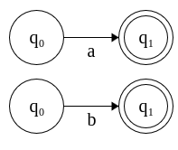
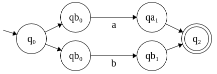
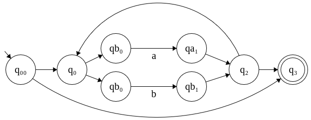
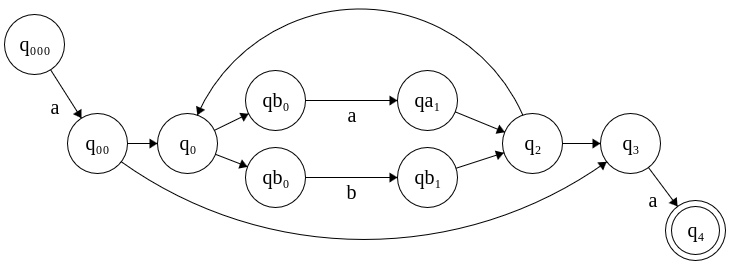

1. Capture the tokens and lexemes from the code below:
```C++
float limitedSquare(x) float x {
  /* returns x-squared, but never more than 100 */
  return (x<=-10.0 || x>=10.0) ? 100 : x*x;
}
```
```

('float', ), (id, limitedSquare), ('(',  ), (id, x), (')', ), ('float', ), (id, x), ('{', ), (comment, /* returns x-squared, but never more than 100 */), ('return', ), ('(', ), (id, x), ('<=', ), ('-', ), (float, 10.0), ('||', ), (id, x), ('>=', ), (float, 10.0), (')', ), ('?', ), (int, 100), (':', ), (id, x), ('*', ), (id, x), (';', ), ('}', )
```

2. Consider the pair (string, tokens) below. Present a minimal set of regular expressions that produces this tokenization. Do not use union.
```
aaabaabbababbb, aa a b aabb a b a bbb
```

```
(aa)*b*, a
```

3. What each of the following regular expressions matches:
`a(a|b)*a`: any string that starts and ends with 'a' and contains any number of 'a's and 'b's in between.
`(a|b)*a(a|b)(a|b)`: any string of 'a's and 'b's in which the second to last character is 'a'
`(aa|bb)*((ab|ba)(aa|bb)*(ab|ba)(aa|bb)*)*`: Any string with a even number of 'a's and 'b's

4. Write the regex for the following languages:
    1. any lower case string that contains all the five vowels in order: `(a-z)*a(a-z)*e(a-z)*i(a-z)*o(a-z)*u(a-z)*`
    2. any string of digits in which there is no repeated digits: a huge union of hardcoded strings

5. Build the NFA for the regexes seem in question 3:
    1. `a(a|b)*a` <br>

`a`, `b`: <br>


`a|b`: <br>


`(a|b)*` <br>


`a(a|b)*a`: <br>



6. Build the DFA for the NFAs obtained in question 5:
